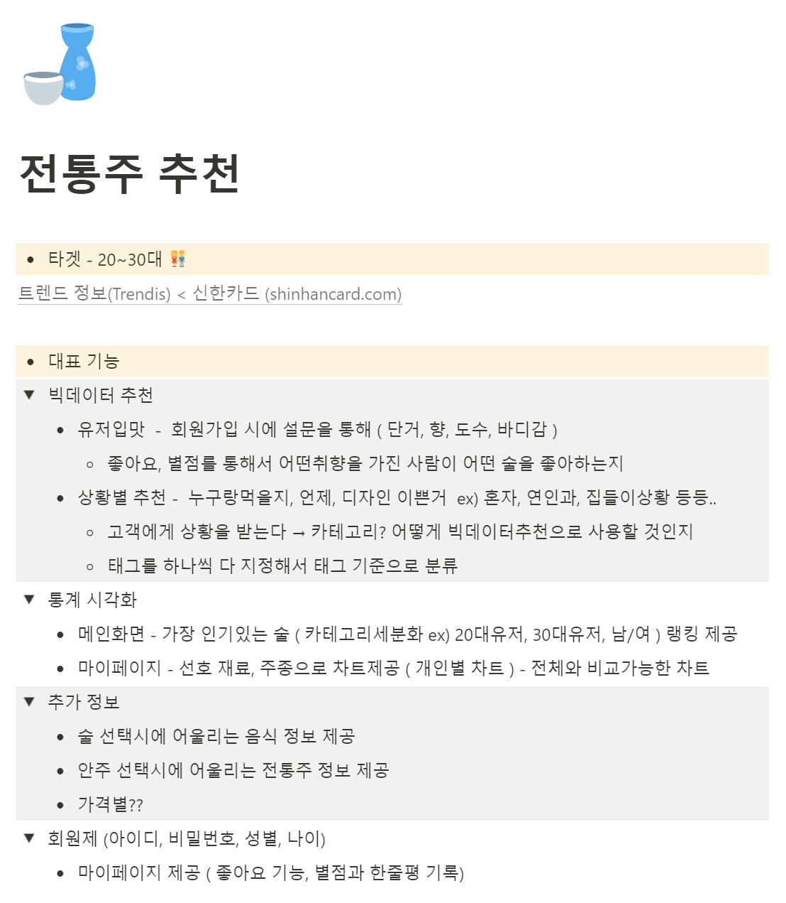
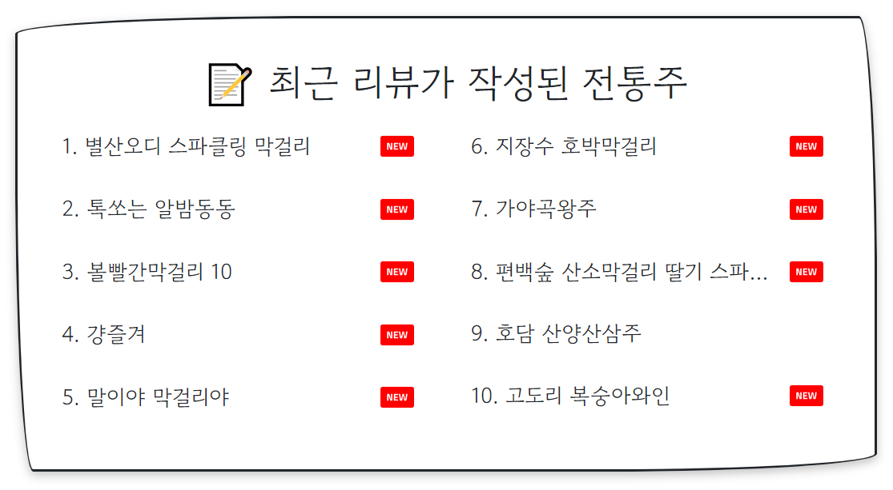

# 📚 Project WouldU 🍶

---

Outline : '2022년 8월 22일 ~ 2022년 10월 7일'의 7주라는 기간 동안, 삼성 청년 소프트웨어 아카데미의 특화 프로젝트를 수행하였다. 우리 팀은 총 5명이다. 우리는 '빅데이터 추천'이라는 도메인을 선택하였고, '빅데이터 기반 전통주 추천 웹 서비스'를 기획하였다. 개발 과정에서는 2명의 Front-end와 3명의 Back-end로 나뉘어 각자 역할을 수행하였고, 그 결과 '우리들의 전통주, 우주'라는 결과물을 선보일 수 있게 되었다.

 7주라는 기간동안 우리 팀이 서로 도와주며 만들어 낸 결과물이기에 그만큼 애정도 깊다. 그런 만큼 이 문서에서 프로젝트에 대해 상세하게 서술해 보고자 한다.

<br>

---

### ⏩ 목차

> 1. [프로젝트 우주 실행 방법](#1)
> 2. [개발 환경](#2)
> 3. [팀 규칙](#3)
> 4. [업무 분담 내역](#4)
> 5. [기획 과정](#5)
> 6. [설계 문서](#6)
> 7. [개발 과정](#7)
> 8. [구현 기능 정리](#8)
> 9. [특화 프로젝트를 마치며](#9)

<br>

---

### 💫 프로젝트 우주 실행 방법 <a id="1"></a>

서버가 제공되는 기간 동안 다음 주소 검색창에 다음과 같이 입력하면 '우리들의 전통주, 우주'를 만날 수 있습니다.

> https://j7a402.p.ssafy.io/


아래의 방법으로도 가능합니다.

> 1. git bash 터미널에 다음과 같이 입력합니다.
>
>    ```bash
>     git clone https://lab.ssafy.com/s07-bigdata-recom-sub2/S07P22A402.git
>    ```
>
> 2. backend 폴더 내에서 터미널을 켠 후 다음을 입력하여 서버를 실행합니다. *(clone 받은 폴더 위치에서 IDE를 켜는 것을 권장하며, 위에서 이어서 해도 무방합니다.)*
>
>    ```bash
>     python -m venv venv
>    source venv/Scripts/activate
>    pip install -r requirements.txt
>    python manage.py makemigrations && python manage.py migrate
>    python manage.py runserver
>    ```
>
> 3. frontend 폴더 내에서 IDE로 실행합니다. 그리고, 최상단에 위치한 .env파일을 열어 다음과 같이 수정합니다.
>
>    ```.env
>    REACT_APP_BASE_URL = http://localhost:8000
>    ```
>
> 4. 이어서 터미널을 켠 후, 다음을 입력하여 실행합니다.
>
>    ```bash
>    npm install && npm start
>    ```
>
> 5. 그렇게 한다면 '우리들의 전통주, 우주'를 만날 수 있습니다.

<br>

---

### 🛠 개발 환경 <a id="2"></a>


- Front-end

  > **-Nivo (데이터 그래프/차트 변환)**
  >
  > *Nivo/bar : 0.80.0*
  >
  > *Nivo/core : 0.80.0*
  >
  > *Nivo/pie : 0.80.0*
  >
  > *Nivo/radar : 0.80.0*
  >
  > 
  >
  > **-React Router DOM**
  >
  > *react-router-dom : 6.4.0*
  >
  > 
  >
  > **-Axios**
  >
  > *Axios : 0.27.2*
  >
  > 
  >
  > -**MUI MUI/material : 5.10.6**
  >
  > *MUI/icons-material : 5.10.6*
  >
  > 
  >
  > **-기타**
  >
  > *sweetalert : 2.1.2 (알림창)*
  >
  > *styled-components : 5.3.5 (디자인)*
  >
  > *swiper : 8.4.2 (이미지 카드 표현)*

- Back-end

  > *Django : 4.1.1*
  >
  > *Python : 3.10.4*
  >
  > *Anaconda : 4.14.0*
  >
  > *pip : 22.2.2*
<br>

---

### 🔗 팀 규칙 <a id="3"></a>

1. **Work day 09:00 or 10:00 스크럼 회의**

   

   *(위는 2022년 9월 한달간의 회의 달력입니다.)*

2. **Webex, Discord를 이용한 실시간 상황 공유**
3. **Git Lab을 이용한 협업**
4. **Notion을 이용한 문서 정리 및 공유**

<br>

---

### 👨🏻‍🤝‍👨🏻 업무 분담 내역 <a id="4"></a>

| 팀원 | 역할 |
| :--: | :--------------------: |
| 한재승 | Front-end, 팀장 |
| 도진욱 | Front-end, UI/UX |
| 박지원 | Back-end, 데이터 전처리, UI/UX |
| 조혜진 | Back-end, Front-end |
| 최지혜 | Back-end, Server |

<br>

---

### **❗ 기획 과정 <a id="5"></a>**

- 수없이 많은 아이디어들 중에서 2주 간의 기획기간 동안 회의한 끝에 다음과 같이 기획할 수 있었습니다.

  *(다음은 팀 Notion 페이지 내의 기획 아이디어 정리 중 일부입니다.)*

  

<br>

- 또한 빅데이터 추천이라는 도메인이므로, 해당 데이터가 있는지 조사할 수 있었습니다.

  *(다음은 팀 Notion 페이지 내의 데이터 정리 중 일부입니다.)*

<br>

- 사용자들의 유형을 파악하여 그에 맞게 추천해 줄 수 있는 사전 설문 또한 기획하였습니다.

  *(다음은 팀 Notion 페이지 내의 유형검사 질문 정리 중 일부입니다.)*

  

<br>

---

### **📃 설계 문서 <a id="6"></a>**

- **기능 명세서 작성**

  *(다음은 팀 Notion 페이지 내의 기능 명세서 정리 중 일부입니다.)*

  

<br>

- **API 명세서 작성**

  *(다음은 팀 Notion 페이지 내의 API 명세서 정리 중 일부입니다.)*

  

<br>

- **와이어프레임 작성**

  *(다음은 Figma에서 작성한 프로토타입입니다.)*

  

<br>

- **ERD 작성**

  

**<br>**

---

### **🎞 개발 과정 <a id="7"></a>**

 개발을 진행하면서 Git Lab 내에서 Git-Flow를 활용하여 효율성을 높일 수 있었는데, 그 쌓아가고 넓혀가는 과정 속에서, 우리는 Webex나 Discord를 통해 실시간으로 소통하며 협력할 수 있었다.

 또한 팀 Notion 페이지를 유용하게 다뤘다고 생각하는데, 그 속에서 우리는 각자가 겪었던 어려움을 해결한 방법이나 유익한 레퍼런스를 공유할 수 있었다.

<br>

- **Back-end**

  *(다음은 팀 Notion 페이지 내의 BE 공유 게시판 중 일부입니다.)*

  

  <br>

- **Front-end**

  *(다음은 팀 Notion 페이지 내의 FE 공유 게시판 중 일부입니다.)*

  

<br>

---

### **✏ 구현 기능 정리 <a id="8"></a>**

- 메인페이지

  - 사용자에게 '실시간 좋아요 순위', '최근 리뷰가 작성된 전통주', '나와 비슷한 유저들이 선택한 전통주' 목록을 보여줌으로써 다양한 방법으로 전통주에 대해 접근할 수 있도록 하였다.

    - **실시간 좋아요 순위 목록 제공**

      

    - **최근 리뷰가 작성된 전통주 목록 제공**

      

    - **나와 비슷한 유저들이 선택한 전통주 목록 제공**

      

<br>

- 검색 페이지

  - 사용자는 찾고 싶은 전통주를 이름과 주종을 입력하여 검색할 수 있다.

    - **검색 기능 제공**

      

      

<br>

- 상세 페이지

  - 서비스를 이용 중 '전통주 카드'를 이용하면 해당 전통주의 상세 페이지로 이동한다.

  - 이로 인해 사용자는 전통주의 정보를 파악할 수 있다.

  - 상세 페이지 내에서는 리뷰를 남길 수도 있으며, 다른 유저들이 남긴 리뷰를 확인할 수 있다.

  - 구매하러 가기 버튼을 눌러 '네이버 쇼핑'으로 바로 이동할 수 있도록 하였다.

  - 전통주에 대한 수치화된 정보를 그래프로 표현하였다.

  - 해당 전통주와 유사한 전통주는 넘어가는 카드 형식으로 표시되어 재미있게 사용자가 접할 수도 있으며, 유익한 정보를 쉽게 얻을 수 있게 하였다.

    - **상세 페이지**

      

    - **리뷰 남기는 기능**

      

    - **데이터 그래프**

      

    - **유사한 전통주 목록 제공**

      

    - **다른 사용자들의 리뷰 목록 제공**

      

<br>

- 추천 페이지

  - 추천 페이지는 프로젝트 명 답게 우주에서 추천을 받는다는 컨셉으로 디자인할 수 있었다. 이로 인해 사용자는 보다 재미있게 서비스를 사용할 수 있을 것이다.

  - '추천 받으러 가는 행성', '전통주 평가하는 행성', '간단히 추천해주는 행성'으로 추천 기능을 구현할 수 있었다.

  - 사용자는 각 목적에 맞게 행성에 들어가서 서비스를 제공받을 수 있다.

    - **추천 페이지**

      

    - **내가 남긴 리뷰를 기반으로 새로운 전통주 목록 추천 받기**

      

    - **전통주를 검색하여, 간단한 평가 남기는 기능**

      

      

      - **사용자의 취향을 표시할 수 있으며, 이로 인해 일회성 추천 결과를 제공한다.**

        

      - **사용자는 총 5가지의 전통주 목록을 제공받을 수 있다.**

        - **만약 '도수' 범위 안에 5개를 추천해주지 못한다면, 맛에 맞는 전통주로 범위를 넓혀 알려준다.**

        

<br>

- 마이 페이지

  - 술바디라는 네이밍을 통해 사용자의 술에 대한 통계를 표현하였고, 술장고라는 네이밍을 통해 사용자가 좋아요를 누른 전통주와 리뷰를 남긴 전통주에 대한 목록을 쉽게 알 수 있다.

  - 리뷰를 기반으로, 자신이 좋아하는 주종 차트와 마신 술들의 평균값을 그래프로 보기 쉽게 표시하였다.

  - 또한, 자신이 속한 유형의 주종 차트와 평균 입맛을 보기 쉽게 표시하였다.

  - 자신이 마신 술들은 마치 뱃지처럼 자신의 마이페이지에 남게 된다. 전통주의 양조장 위치를 기반으로 표시될 것이며, 이또한 우리 주제에 맞게 행성으로 디자인하여 사용자들이 소유하고 싶어할 것이다.

    - **자신이 좋아하는 주종 차트와 자신이 먹은 전통주의 평균값 차트**

      

    - **자신이 속한 유형의 좋아하는 주종 차트와 먹은 전통주의 평균값 차트**

      

    - **좋아요를 누른 목록과 평가한 목록에 대한 정보 제공**

      

    - **전통주의 양조장 위치 기반으로 한 뱃지 제공**

      

<br>

---

### **⛳ 특화 프로젝트를 마치며 <a id="9"></a>**

7주라는 주어진 기간동안 데이터 수집 및 정제, 추천알고리즘 구현을 포함하여 프로젝트를 완성하여야 했기 때문에 결과물에 대해 약간의 아쉬움이 남는다.
많은 양의 데이터를 다루다 보니 데이터 처리속도나 페이지 렌더링 속도가 늦어지기도 하였고, Django 의 ORM 을 보다 효율적으로 사용하지 못하였다. 
이후에 기회가 주어진다면 구조나 데이터 처리를 보다 효율적으로 해서, 더 빠르고 가벼운 결과를 내고 싶다.


<br>

---


